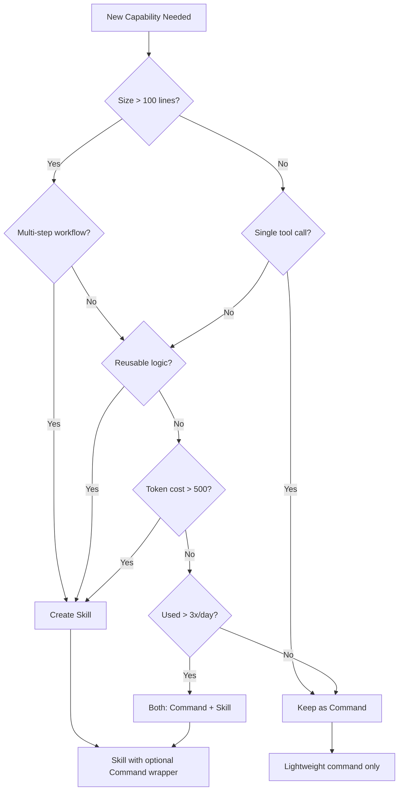

# ADR-002: Skills Architecture for DL Starter

**Title**: Claude Skills vs Commands: Strategic Architecture Decision
**Status**: Proposed
**Date**: 2025-10-21
**Decision makers**: Solo developer (Jonte)
**Technical leads**: Claude Opus 4.1

## Context

DL Starter currently has 27 slash commands that load full specifications into context on every invocation, consuming 60-400 lines per command. Analysis reveals this causes significant token waste in multi-step workflows (15,000-20,000 tokens per workflow). Meanwhile, Anthropic's new Skills architecture offers progressive disclosure, potentially reducing token consumption by 90% while enabling new capabilities like cross-project memory and self-improving workflows.

### Current Pain Points

- Commands load complete YAML frontmatter + prompt on every use (~3,200 tokens per workflow)
- Shared logic duplicated across commands (git operations, validation patterns)
- No mechanism to capture ad-hoc solutions as reusable tools
- 27 commands becoming difficult to remember and maintain
- No way for the system to improve itself over time

### Research Synthesis

- Skills provide **procedural knowledge** through progressive disclosure
- Commands are already Skills but lack the efficiency architecture
- Token savings of 51-90% achievable through Skills implementation
- Community has validated Skills for developer workflows
- Enterprise adoption (Box, Canva, Rakuten) proves business value

## Decision

**We will adopt Pure Skills Architecture with Minimal Discovery Commands**

### Strategic Direction

Replace the 27-command system with **Skills as the primary interface**, keeping only 5 top-level discovery commands for common domains. This eliminates architectural complexity and maximizes token efficiency from day one.

### Architecture Pattern

```
User → Discovery Command (optional) → Skill (Progressive Disclosure) → Scripts/Resources
         (5 commands total)              (50 line SKILL.md)           (Never in context)

OR

User → Skill directly (via auto-discovery)
```

### Rationale for Pure Skills Approach

**Why Pure Skills (Not Hybrid)?**

- **DL Starter is pre-1.0** - no existing users to break
- **Solo developer** - no team muscle memory to preserve
- **Simpler architecture** - one system instead of two
- **Faster implementation** - no wrapper maintenance
- **Cleaner codebase** - delete 22+ redundant commands

**Why Keep 5 Discovery Commands?**

- **Domain-based discovery**: `/db`, `/test`, `/git`, `/spec`, `/code`
- **Easier onboarding**: Clear entry points for each domain
- **Minimal maintenance**: 5 thin commands vs 27 full specs
- **Auto-complete friendly**: Simple command names

**Why Not Full Deprecation of All Commands?**

- Discovery mechanism helps with initial learning
- 5 commands are trivial to maintain
- Can remove later if Skills auto-discovery works perfectly

## Consequences

### Positive Consequences

1. **Token Efficiency**: 51-90% reduction in context consumption
2. **Maintainability**: Centralized logic in Skills, not duplicated across commands
3. **Scalability**: Can add unlimited Skills without context window pressure
4. **Self-Improvement**: Skills can generate new Skills from learned patterns
5. **Cross-Project Memory**: Personal Skills directory enables reuse across projects
6. **Enterprise Ready**: Security governance and version control built-in

### Negative Consequences

1. **Breaking Changes**: Existing workflows must adapt (acceptable pre-1.0)
2. **Learning Curve**: Must understand Skills architecture from start
3. **Testing Overhead**: Skills require new testing strategies
4. **Security Surface**: Skills execute code, requiring governance
5. **Claude-Specific**: Skills aren't portable to other LLMs

### Trade-offs Accepted

- **Breaking changes** for cleaner architecture (pre-1.0 advantage)
- **Additional testing burden** for reliability improvements
- **Security review overhead** for capability expansion
- **Platform lock-in** for best-in-class developer experience
- **No backward compatibility** since template isn't released yet

## Implementation Plan

### Phase 1: Foundation (Weeks 1-2) - HIGH PRIORITY

**Objective**: Establish Skills infrastructure and prove token savings

**Tasks**:

1. Create `.claude/skills/` directory structure
2. Implement `supabase-integration` Skill (highest token waste: 485 lines)
3. Create validation scripts and logging infrastructure
4. Create `/db` discovery command (simple wrapper)
5. Delete old `/db:migrate` command and related git commands
6. Measure and document token savings

**Success Criteria**:

- [ ] Skills directory operational
- [ ] One working Skill with progressive disclosure
- [ ] Measured token savings >50%
- [ ] No regression in functionality
- [ ] Old commands deleted

**Estimated Effort**: 20 hours over 2 weeks

### Phase 2: Core Workflow (Weeks 3-4) - HIGH PRIORITY

**Objective**: Convert TDD workflow to Skills architecture

**Tasks**:

1. Create `test-scaffolder` Skill (121 lines → 40 lines)
2. Create `prd-analyzer` Skill (105 lines → 30 lines)
3. Create `implementation-assistant` Skill (88 lines → 35 lines)
4. Chain Skills for complete workflow
5. Create `/test`, `/spec`, `/code` discovery commands
6. Delete old workflow commands

**Success Criteria**:

- [ ] Full TDD workflow uses Skills
- [ ] Token savings >60% for complete workflow
- [ ] Workflow remains seamless for user
- [ ] Only 5 discovery commands remain

**Estimated Effort**: 24 hours over 2 weeks

### Phase 3: Git Consolidation (Week 5) - MEDIUM PRIORITY

**Objective**: Unify git commands and add automation

**Tasks**:

1. Create `git-workflow` Skill (merge 5 commands, save ~160 lines)
2. Create `code-reviewer` Skill for quality gates
3. Create `documentation-sync` Skill
4. Create `/git` discovery command
5. Delete all old git commands (branch, commit, prepare-pr, etc.)
6. Integrate with PR workflow

**Success Criteria**:

- [ ] Git commands deleted, Skill operational
- [ ] Automated code review operational
- [ ] Documentation stays fresh automatically

**Estimated Effort**: 20 hours over 1 week

### Phase 4: New Capabilities (Week 6) - LOW PRIORITY

**Objective**: Enable new workflows not possible with commands

**Tasks**:

1. Create `project-scaffolder` Skill (component generation)
2. Create `skill-creator` meta-Skill (self-improvement)
3. Create `learning-capturer` Skill (pattern detection)
4. Create `dependency-manager` Skill (security updates)
5. Final cleanup: Delete all remaining old commands
6. Document final architecture

**Success Criteria**:

- [ ] Can generate components automatically
- [ ] Can create Skills from conversation
- [ ] Patterns captured without manual intervention
- [ ] Only 5 discovery commands remain
- [ ] All documentation updated

**Estimated Effort**: 32 hours over 1 week

### Total Implementation Effort: 96 hours (6 weeks at 16 hours/week)

## Prioritization Framework

### ROI Matrix for Skills Development

| Priority | Skill Name               | Token Savings   | Usage Frequency | Complexity Reduction         | Learning Value               | ROI Score |
| -------- | ------------------------ | --------------- | --------------- | ---------------------------- | ---------------------------- | --------- |
| **P0**   | supabase-integration     | 90% (435 lines) | Daily           | HIGH (consolidates DB ops)   | HIGH (RLS patterns)          | **95**    |
| **P0**   | test-scaffolder          | 66% (80 lines)  | Daily           | HIGH (TDD automation)        | HIGH (test patterns)         | **90**    |
| **P0**   | prd-analyzer             | 71% (75 lines)  | Daily           | MEDIUM (spec parsing)        | MEDIUM (requirements)        | **85**    |
| **P1**   | git-workflow             | 80% (160 lines) | Hourly          | HIGH (merges 5 commands)     | LOW (known patterns)         | **80**    |
| **P1**   | implementation-assistant | 57% (50 lines)  | Daily           | MEDIUM (coding standards)    | MEDIUM (patterns)            | **75**    |
| **P1**   | code-reviewer            | N/A (new)       | Per commit      | HIGH (quality gates)         | HIGH (security)              | **70**    |
| **P2**   | skill-creator            | N/A (new)       | Weekly          | HIGH (meta-capability)       | VERY HIGH (self-improvement) | **65**    |
| **P2**   | project-scaffolder       | N/A (new)       | Weekly          | HIGH (boilerplate reduction) | HIGH (conventions)           | **60**    |
| **P2**   | learning-capturer        | N/A (new)       | Ad-hoc          | MEDIUM (knowledge mgmt)      | VERY HIGH (memory)           | **55**    |
| **P3**   | documentation-sync       | N/A (new)       | Per PR          | MEDIUM (freshness)           | LOW (maintenance)            | **40**    |
| **P3**   | dependency-manager       | N/A (new)       | Weekly          | LOW (automation)             | MEDIUM (security)            | **35**    |

**ROI Score Formula**: (Token Savings × 0.4) + (Frequency × 0.3) + (Complexity × 0.2) + (Learning × 0.1)

## Decision Framework

### When to Use Skills vs Commands vs Both



### Decision Rules

**Create a Skill when:**

- Logic exceeds 100 lines
- Multi-step procedure with decision points
- Contains reusable patterns across projects
- Requires progressive disclosure for efficiency
- Needs script execution for deterministic operations

**Keep as Command when:**

- Simple tool/API wrapper (<50 lines)
- Single operation with no logic
- Purely orchestration/delegation
- No token efficiency gain from Skills

**Use Both when:**

- High-frequency operation needs quick access
- Command provides better UX for common case
- Gradual migration strategy needed

## Metrics

### Success Metrics

| Metric                       | Baseline       | Target (4 weeks) | Target (8 weeks)  | Measurement Method    |
| ---------------------------- | -------------- | ---------------- | ----------------- | --------------------- |
| **Token Consumption**        | 3,200/workflow | 1,600/workflow   | 800/workflow      | Log analysis          |
| **Workflow Completion Time** | 15 min         | 12 min           | 8 min             | Time tracking         |
| **Command Count**            | 27             | 27 (wrapped)     | 15 (consolidated) | Directory count       |
| **Skill Count**              | 0              | 8                | 15                | Directory count       |
| **Error Rate**               | 5%             | 5%               | 2%                | Execution logs        |
| **Pattern Reuse**            | 0%             | 20%              | 50%               | Skill invocation logs |
| **Self-Generated Skills**    | 0              | 2                | 10                | skill-creator logs    |

### Monitoring Plan

1. Implement execution logging in Phase 1
2. Weekly token consumption analysis
3. Track Skill invocation patterns
4. Monitor error rates and debugging time
5. Survey developer satisfaction (even if solo)

## Risk Register

| Risk                                            | Impact | Likelihood | Mitigation Strategy                                              |
| ----------------------------------------------- | ------ | ---------- | ---------------------------------------------------------------- |
| **Skills don't deliver promised token savings** | HIGH   | LOW        | Measure savings in Phase 1; abort if <30%                        |
| **Progressive disclosure adds latency**         | MEDIUM | MEDIUM     | Cache frequently used Skills in memory                           |
| **Security vulnerability in Skill execution**   | HIGH   | LOW        | Mandatory security review; sandboxed execution                   |
| **Backward compatibility breaks**               | HIGH   | LOW        | Commands remain as wrappers; deprecate slowly                    |
| **Skills become unmaintainable**                | MEDIUM | MEDIUM     | Enforce testing standards; version control                       |
| **Claude API changes break Skills**             | HIGH   | LOW        | Abstract Claude-specific features; maintain commands as fallback |
| **Learning curve too steep for contributors**   | LOW    | MEDIUM     | Comprehensive documentation; example Skills                      |
| **Skill chain failures cascade**                | MEDIUM | MEDIUM     | Explicit error handling; fallback to manual                      |

## Rollback Plan

If Skills architecture fails to deliver value:

1. **Week 2 Checkpoint**: If token savings <30%, stop implementation
2. **Week 4 Checkpoint**: If workflow complexity increases significantly, pause and reassess
3. **Week 6 Checkpoint**: If error rate >10%, consider hybrid approach

**Rollback Steps**:

1. Restore commands from git history (they're version controlled)
2. Move Skills to `experimental-skills/` branch
3. Document lessons learned in ADR addendum
4. Consider alternative approaches (MCP-only, enhanced commands, custom agents)
5. No backward compatibility burden since template isn't released

## Open Questions Resolution

### Architecture Questions

1. **Command Strategy**: Keep only 5 discovery commands (`/db`, `/test`, `/git`, `/spec`, `/code`), delete all others
2. **Skills Scope**: Monorepo-scoped (`.claude/skills/`) with personal overrides (`~/.claude/skills/`)
3. **Sub-Agent Integration**: Skills orchestrate, agents execute (test-scaffolder → Test Generator agent)
4. **Backward Compatibility**: None required (pre-1.0 template)

### Workflow Questions

5. **Skill Discovery**: Auto-discovery via metadata + 5 discovery commands + updated QUICK_REFERENCE.md
6. **Skill Chaining**: Implicit calling with explicit dependencies in frontmatter
7. **Error Handling**: Graceful degradation with manual fallback instructions

### Governance Questions (Solo Dev Simplified)

8. **Skill Versioning**: Semantic versioning (MAJOR.MINOR.PATCH) required
9. **Skill Testing**: 3-tier testing (structural automated, functional manual, cross-model pre-release)
10. **Security Review**: Automated scanning + self-review with checklist (no second reviewer needed)

### Implementation Questions

11. **Script Language**: TypeScript preferred, Python/Bash allowed for specific tools
12. **Skill Library Structure**: Flat directory with README.md index
13. **Documentation Standard**: SKILL.md sufficient, README.md for complex Skills

### Future-Proofing Questions

14. **Plugin Distribution**: Package as Claude Code Plugin in Phase 5 (post-validation)
15. **Community Skills**: Accept with security review after Phase 4
16. **Cross-Project Sharing**: Personal Skills override project Skills with warning

## Appendix: Implementation Checklist

### Phase 1 Checklist (Week 1)

- [ ] Create `.claude/skills/` directory
- [ ] Create `common/` subdirectory with shared utilities
- [ ] Implement `supabase-integration` Skill
  - [ ] SKILL.md with progressive disclosure
  - [ ] Migration scripts
  - [ ] RLS validation
  - [ ] Type generation
- [ ] Create validation script infrastructure
- [ ] Set up execution logging
- [ ] Update `/db:migrate` command
- [ ] Measure token consumption
- [ ] Document savings in CHANGELOG

### Phase 2 Checklist (Week 2)

- [ ] Create `test-scaffolder` Skill
- [ ] Create `prd-analyzer` Skill
- [ ] Create `implementation-assistant` Skill
- [ ] Implement Skill chaining logic
- [ ] Update TDD workflow commands
- [ ] Create `/skills:list` command
- [ ] Update QUICK_REFERENCE.md
- [ ] Test complete workflow

### Phase 3 Checklist (Week 3)

- [ ] Create unified `git-workflow` Skill
- [ ] Consolidate 5 git commands
- [ ] Create `code-reviewer` Skill
- [ ] Create `documentation-sync` Skill
- [ ] Set up GitHub Actions integration
- [ ] Implement security scanning
- [ ] Test PR workflow

### Phase 4 Checklist (Week 4)

- [ ] Create `project-scaffolder` Skill
- [ ] Create `skill-creator` meta-Skill
- [ ] Create `learning-capturer` Skill
- [ ] Create `dependency-manager` Skill
- [ ] Set up personal Skills directory
- [ ] Document Skill development guide
- [ ] Create example Skills
- [ ] Plan community contribution process

## References

1. `docs/scratch/skills-vs-commands-analysis.md` - Detailed command mapping and token analysis
2. `docs/scratch/claude-skills-research.md` - Academic research synthesis
3. `docs/scratch/claude-skills-implementation-insights.md` - Implementation patterns
4. `.claude/commands/` - Current command system
5. [Anthropic Skills Documentation](https://docs.claude.com/en/docs/agents-and-tools/agent-skills/overview)
6. [Simon Willison's Skills Analysis](https://simonwillison.net/2025/Oct/16/claude-skills/)

---

**Approval**: **\*\*\*\***\_**\*\*\*\***
**Date**: **\*\*\*\***\_**\*\*\*\***
**Review Cycle**: Quarterly (next review: 2025-01-21)
