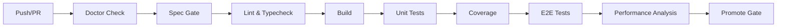

# Testing Guide

Comprehensive guide to testing in the dl-starter project, covering unit tests, component tests, E2E tests, database tests, and Skills testing.

## Table of Contents

- [Testing Philosophy](#testing-philosophy)
- [Testing Stack Overview](#testing-stack-overview)
- [Getting Started](#getting-started)
- [Unit Testing](#unit-testing)
- [Component Testing](#component-testing)
- [E2E Testing](#e2e-testing)
- [Database Testing](#database-testing)
- [Skills Testing](#skills-testing)
- [Running Tests](#running-tests)
- [CI/CD Pipeline](#cicd-pipeline)
- [Test Coverage](#test-coverage)
- [Performance Guidelines](#performance-guidelines)
- [Common Patterns](#common-patterns)
- [Troubleshooting](#troubleshooting)

---

## Testing Philosophy

### Goals

1. **Quality Assurance**: Catch bugs before production
2. **Confidence**: Enable safe refactoring and feature development
3. **Documentation**: Tests serve as living documentation
4. **Speed**: Fast feedback cycles (<20s for unit tests)
5. **Coverage**: Maintain 70% code coverage minimum

### Testing Pyramid

```
        /\
       /  \       E2E Tests (5-10%)
      /----\      - Critical user flows
     /      \     - Cross-browser testing
    /--------\    Integration Tests (20-30%)
   /          \   - Component interactions
  /------------\  - API endpoints
 /--------------\ Unit Tests (60-75%)
                  - Pure functions
                  - Business logic
```

### Best Practices

- **Write tests first** when doing TDD
- **Keep tests simple** and readable
- **Test behavior**, not implementation
- **Mock external dependencies**
- **Use descriptive test names**
- **Isolate tests** (no shared state)

---

## Testing Stack Overview

### Core Tools

| Tool | Version | Purpose | Documentation |
|------|---------|---------|---------------|
| **Vitest** | 3.2.4 | Unit & integration testing | [vitest.dev](https://vitest.dev) |
| **Playwright** | 1.56.1 | E2E browser testing | [playwright.dev](https://playwright.dev) |
| **BATS** | 1.13.0 | Bash script testing | [bats-core.github.io](https://bats-core.readthedocs.io) |
| **pgTAP** | Latest | Database/RLS testing | [pgtap.org](https://pgtap.org) |
| **React Testing Library** | 16.3.0 | Component testing | [testing-library.com](https://testing-library.com) |

### Additional Tools

- **@vitest/coverage-v8**: Code coverage reporting
- **@axe-core/playwright**: Accessibility testing
- **@testing-library/jest-dom**: Custom matchers
- **@testing-library/user-event**: User interaction simulation

---

## Getting Started

### Prerequisites

```bash
# Ensure all dependencies are installed
pnpm install

# Start Supabase (required for RLS tests)
pnpm db:start
```

### Environment Setup

Test environment variables are automatically configured in `apps/web/tests/setup.ts`:

```typescript
process.env.NEXT_PUBLIC_SUPABASE_URL = 'http://localhost:54321';
process.env.NEXT_PUBLIC_SUPABASE_ANON_KEY = 'test-anon-key';
```

### Quick Start

```bash
# Run all tests
pnpm test

# Run unit tests only
pnpm test:unit

# Run E2E tests
pnpm test:e2e

# Generate coverage report
pnpm test:coverage

# Watch mode
pnpm --filter=web run test:watch
```

---

## Unit Testing

### Location

Unit tests live in `apps/web/tests/unit/`:

```
tests/unit/
├── components/         # Component tests
├── lib/               # Utility function tests
└── db/                # Database validation tests
```

### Configuration

Vitest config at `apps/web/vitest.config.ts`:

```typescript
export default defineConfig({
  plugins: [react()],
  test: {
    globals: true,
    environment: 'jsdom',
    setupFiles: ['./tests/setup.ts'],
    include: [
      'src/**/*.test.{ts,tsx}',
      'tests/unit/**/*.test.{ts,tsx}',
      'tests/sub-agents/**/*.test.{ts,tsx}',
    ],
    exclude: ['e2e/**', 'tests/e2e/**', 'node_modules/**', '.next/**'],
    slowTestThreshold: 1000, // Warn for tests >1s
  },
});
```

### Writing Unit Tests

**Pure Function Example:**

```typescript
// src/lib/sum.test.ts
import { describe, expect, it } from 'vitest';
import { sum } from './sum';

describe('sum', () => {
  it('adds two numbers correctly', () => {
    expect(sum(2, 3)).toBe(5);
  });

  it('handles negative numbers', () => {
    expect(sum(-1, 1)).toBe(0);
  });

  it('handles zero', () => {
    expect(sum(0, 0)).toBe(0);
  });
});
```

**Utility Function with Validation Example:**

```typescript
// tests/unit/lib/validation.test.ts
import { describe, expect, it } from 'vitest';
import { validateEmail, validatePassword } from '@/lib/validation';

describe('validateEmail', () => {
  it('accepts valid email addresses', () => {
    expect(validateEmail('user@example.com')).toBe(true);
  });

  it('rejects invalid email addresses', () => {
    expect(validateEmail('invalid')).toBe(false);
    expect(validateEmail('@example.com')).toBe(false);
  });
});

describe('validatePassword', () => {
  it('requires minimum length', () => {
    expect(validatePassword('abc')).toBe(false);
    expect(validatePassword('abcd1234')).toBe(true);
  });

  it('requires alphanumeric characters', () => {
    expect(validatePassword('abcdefgh')).toBe(false);
    expect(validatePassword('abc123')).toBe(true);
  });
});
```

### Best Practices

- **Arrange-Act-Assert**: Structure tests clearly
- **One assertion per test** (when possible)
- **Use descriptive names**: `it('rejects passwords shorter than 8 characters')`
- **Test edge cases**: Empty strings, null, undefined, boundary values
- **Avoid test interdependencies**: Each test should be independent

---

## Component Testing

### Location

Component tests live alongside unit tests in `apps/web/tests/unit/components/`:

```
tests/unit/components/
├── card.test.tsx
├── section-header.test.tsx
├── theme-provider.test.tsx
├── link.test.tsx
├── header.test.tsx
└── theme-toggle.test.tsx
```

### Setup

The test environment mocks Next.js-specific APIs:

```typescript
// apps/web/tests/setup.ts
import '@testing-library/jest-dom';
import { cleanup } from '@testing-library/react';
import { afterEach, beforeAll, vi } from 'vitest';

afterEach(() => cleanup());

beforeAll(() => {
  // Mock Next.js router
  vi.mock('next/navigation', () => ({
    useRouter: () => ({
      push: vi.fn(),
      replace: vi.fn(),
      prefetch: vi.fn(),
      back: vi.fn(),
    }),
    usePathname: () => '/',
    useSearchParams: () => new URLSearchParams(),
  }));

  // Mock window.matchMedia for theme testing
  Object.defineProperty(window, 'matchMedia', {
    writable: true,
    value: vi.fn().mockImplementation((query) => ({
      matches: false,
      media: query,
      onchange: null,
      addEventListener: vi.fn(),
      removeEventListener: vi.fn(),
      dispatchEvent: vi.fn(),
    })),
  });
});
```

### Writing Component Tests

**Basic Component Test:**

```typescript
// tests/unit/components/card.test.tsx
import { describe, expect, it } from 'vitest';
import { render, screen } from '@testing-library/react';
import { Card, CardHeader, CardTitle, CardContent } from '@ui/components/card';

describe('Card', () => {
  it('renders with title and content', () => {
    render(
      <Card>
        <CardHeader>
          <CardTitle>Test Title</CardTitle>
        </CardHeader>
        <CardContent>Test content</CardContent>
      </Card>
    );

    expect(screen.getByText('Test Title')).toBeInTheDocument();
    expect(screen.getByText('Test content')).toBeInTheDocument();
  });

  it('applies custom className', () => {
    const { container } = render(
      <Card className="custom-class">Content</Card>
    );

    expect(container.firstChild).toHaveClass('custom-class');
  });
});
```

**Interactive Component Test:**

```typescript
// tests/unit/components/theme-toggle.test.tsx
import { describe, expect, it, vi } from 'vitest';
import { render, screen } from '@testing-library/react';
import userEvent from '@testing-library/user-event';
import { ThemeToggle } from '@/components/theme-toggle';
import { ThemeProvider } from 'next-themes';

// Mock next-themes
vi.mock('next-themes', () => ({
  ThemeProvider: ({ children }: { children: React.ReactNode }) => (
    <div>{children}</div>
  ),
  useTheme: () => ({
    theme: 'light',
    setTheme: vi.fn(),
  }),
}));

describe('ThemeToggle', () => {
  it('renders toggle button', () => {
    render(
      <ThemeProvider>
        <ThemeToggle />
      </ThemeProvider>
    );

    expect(screen.getByRole('button')).toBeInTheDocument();
  });

  it('toggles theme on click', async () => {
    const setTheme = vi.fn();
    vi.mocked(useTheme).mockReturnValue({
      theme: 'light',
      setTheme,
    });

    render(<ThemeToggle />);

    await userEvent.click(screen.getByRole('button'));
    expect(setTheme).toHaveBeenCalledWith('dark');
  });
});
```

**Component with Props:**

```typescript
// tests/unit/components/section-header.test.tsx
import { describe, expect, it } from 'vitest';
import { render, screen } from '@testing-library/react';
import { SectionHeader } from '@/components/section-header';

describe('SectionHeader', () => {
  it('renders title', () => {
    render(<SectionHeader title="Test Section" />);
    expect(screen.getByText('Test Section')).toBeInTheDocument();
  });

  it('renders optional description', () => {
    render(
      <SectionHeader
        title="Test Section"
        description="Test description"
      />
    );
    expect(screen.getByText('Test description')).toBeInTheDocument();
  });

  it('does not render description when not provided', () => {
    const { container } = render(<SectionHeader title="Test Section" />);
    expect(container.querySelector('.description')).not.toBeInTheDocument();
  });
});
```

### Component Testing Best Practices

- **Test user-facing behavior**, not implementation
- **Use semantic queries**: `getByRole`, `getByLabelText`, `getByText`
- **Avoid testing IDs** unless necessary
- **Test accessibility**: Check ARIA attributes, keyboard navigation
- **Mock external dependencies**: APIs, context providers, routers
- **Test different states**: Loading, error, success, empty

---

## E2E Testing

### Location

E2E tests live in `apps/web/tests/e2e/`:

```
tests/e2e/
├── auth-flows.spec.ts
├── accessibility.spec.ts
├── design-viewer.spec.ts
├── smoke.spec.ts
└── mobile-responsive.spec.ts
```

### Configuration

Playwright config at `playwright.config.ts`:

```typescript
export default defineConfig({
  testDir: 'apps/web/tests/e2e',
  testMatch: '**/*.spec.ts',
  fullyParallel: true,
  forbidOnly: !!process.env.CI,
  retries: process.env.CI ? 2 : 0,
  workers: process.env.CI ? 1 : undefined,
  reporter: process.env.CI ? 'github' : 'list',
  timeout: 30_000,
  expect: { timeout: 5_000 },
  use: {
    baseURL: 'http://localhost:3000',
    trace: 'on-first-retry',
    screenshot: 'only-on-failure',
  },
  projects: [
    { name: 'chromium', use: { ...devices['Desktop Chrome'] } },
    { name: 'Mobile Chrome', use: { ...devices['Pixel 5'] } },
  ],
  webServer: {
    command: 'pnpm --filter=web run start',
    port: 3000,
    reuseExistingServer: !process.env.CI,
    timeout: 120_000,
  },
});
```

### Writing E2E Tests

**Smoke Test Example:**

```typescript
// tests/e2e/smoke.spec.ts
import { test, expect } from '@playwright/test';

test.describe('Smoke Tests', () => {
  test('homepage loads successfully', async ({ page }) => {
    await page.goto('/');
    await expect(page).toHaveTitle(/dl-starter/);
  });

  test('navigation menu is visible', async ({ page }) => {
    await page.goto('/');
    const nav = page.locator('nav');
    await expect(nav).toBeVisible();
  });

  test('can navigate to about page', async ({ page }) => {
    await page.goto('/');
    await page.click('text=About');
    await expect(page).toHaveURL(/.*about/);
  });
});
```

**Authentication Flow Example:**

```typescript
// tests/e2e/auth-flows.spec.ts
import { test, expect } from '@playwright/test';

test.describe('Authentication Flows', () => {
  test('user can sign up', async ({ page }) => {
    await page.goto('/signup');

    // Fill form
    await page.fill('input[name="email"]', 'test@example.com');
    await page.fill('input[name="password"]', 'password123');
    await page.fill('input[name="confirmPassword"]', 'password123');

    // Submit
    await page.click('button[type="submit"]');

    // Verify redirect to dashboard
    await expect(page).toHaveURL(/.*dashboard/);
  });

  test('user can login', async ({ page }) => {
    await page.goto('/login');

    await page.fill('input[name="email"]', 'test@example.com');
    await page.fill('input[name="password"]', 'password123');
    await page.click('button[type="submit"]');

    await expect(page).toHaveURL(/.*dashboard/);
  });

  test('shows error for invalid credentials', async ({ page }) => {
    await page.goto('/login');

    await page.fill('input[name="email"]', 'invalid@example.com');
    await page.fill('input[name="password"]', 'wrongpassword');
    await page.click('button[type="submit"]');

    await expect(page.locator('.error-message')).toBeVisible();
  });
});
```

**Accessibility Testing Example:**

```typescript
// tests/e2e/accessibility.spec.ts
import { test, expect } from '@playwright/test';
import AxeBuilder from '@axe-core/playwright';

test.describe('Accessibility', () => {
  test('homepage has no accessibility violations', async ({ page }) => {
    await page.goto('/');

    const accessibilityScanResults = await new AxeBuilder({ page })
      .analyze();

    expect(accessibilityScanResults.violations).toEqual([]);
  });

  test('supports keyboard navigation', async ({ page }) => {
    await page.goto('/');

    // Tab through interactive elements
    await page.keyboard.press('Tab');
    const firstLink = page.locator('a:focus');
    await expect(firstLink).toBeVisible();

    // Press Enter to activate
    await page.keyboard.press('Enter');
    await expect(page).not.toHaveURL('/');
  });
});
```

### E2E Testing Best Practices

- **Test critical user flows**: Authentication, checkout, data submission
- **Use page objects** for complex pages
- **Wait for elements** properly: `waitForSelector`, `waitForLoadState`
- **Test across browsers**: Chrome, Firefox, Safari, mobile
- **Handle flaky tests**: Add retries, increase timeouts, improve selectors
- **Take screenshots on failure**: Already configured in `playwright.config.ts`

---

## Database Testing

### Overview

Database testing ensures:

- **RLS policies** work correctly
- **Data isolation** between users
- **Schema integrity**
- **Migration safety**

### Tools

- **pgTAP**: SQL-level testing framework
- **Vitest**: RLS validation from application layer

### Location

```
supabase/tests/         # pgTAP tests
apps/web/tests/rls/     # RLS validation tests
apps/web/tests/unit/db/ # Database utility tests
```

### pgTAP Tests

**Setup** (`supabase/tests/000-setup-tests-hooks.sql`):

```sql
-- Enable pgTAP extension
CREATE EXTENSION IF NOT EXISTS pgtap;

-- Test helper functions
CREATE OR REPLACE FUNCTION tests.create_test_user(
  email TEXT,
  password TEXT DEFAULT 'testpassword'
) RETURNS uuid AS $$
DECLARE
  user_id uuid;
BEGIN
  -- Insert test user into auth.users
  INSERT INTO auth.users (email, encrypted_password)
  VALUES (email, crypt(password, gen_salt('bf')))
  RETURNING id INTO user_id;

  RETURN user_id;
END;
$$ LANGUAGE plpgsql;
```

**RLS Enabled Test** (`supabase/tests/001-rls-enabled.sql`):

```sql
BEGIN;
SELECT plan(5);

-- Test that RLS is enabled on all public tables
SELECT has_table('public', 'users', 'users table exists');
SELECT row_security_on('public', 'users', 'RLS enabled on users');

SELECT has_table('public', 'profiles', 'profiles table exists');
SELECT row_security_on('public', 'profiles', 'RLS enabled on profiles');

SELECT has_table('public', '_health_check', 'health check table exists');

SELECT * FROM finish();
ROLLBACK;
```

**User Isolation Test** (`supabase/tests/002-user-isolation.sql`):

```sql
BEGIN;
SELECT plan(4);

-- Create test users
SET LOCAL "request.jwt.claim.sub" = tests.create_test_user('user1@test.com');
INSERT INTO public.profiles (user_id, username)
VALUES (current_setting('request.jwt.claim.sub')::uuid, 'user1');

SET LOCAL "request.jwt.claim.sub" = tests.create_test_user('user2@test.com');
INSERT INTO public.profiles (user_id, username)
VALUES (current_setting('request.jwt.claim.sub')::uuid, 'user2');

-- Verify user1 can only see their own data
SET LOCAL "request.jwt.claim.sub" = (SELECT id FROM auth.users WHERE email = 'user1@test.com');
SELECT is(COUNT(*)::INT, 1, 'User1 sees only their own profile')
FROM public.profiles;

-- Verify user2 can only see their own data
SET LOCAL "request.jwt.claim.sub" = (SELECT id FROM auth.users WHERE email = 'user2@test.com');
SELECT is(COUNT(*)::INT, 1, 'User2 sees only their own profile')
FROM public.profiles;

SELECT * FROM finish();
ROLLBACK;
```

**RLS Optimization Test** (`supabase/tests/003-rls-optimization.sql`):

```sql
BEGIN;
SELECT plan(3);

-- Verify indexes exist for RLS performance
SELECT has_index('public', 'profiles', 'idx_profiles_user_id',
  'Index on profiles.user_id exists');

-- Verify policies use role specification
SELECT policies_are('public', 'profiles',
  ARRAY['Users can view own profile', 'Users can update own profile'],
  'All expected policies exist');

-- Performance check: Query should use index
EXPLAIN (FORMAT JSON) SELECT * FROM public.profiles
WHERE user_id = current_setting('request.jwt.claim.sub')::uuid;

SELECT * FROM finish();
ROLLBACK;
```

### Running Database Tests

```bash
# Run all pgTAP tests
pnpm test:rls

# Watch mode (re-run on changes)
pnpm test:rls:watch

# Run specific test file
supabase test db supabase/tests/002-user-isolation.sql
```

### Application-Layer RLS Tests

**RLS Validation Test** (`apps/web/tests/rls/user-isolation.test.ts`):

```typescript
import { describe, expect, it, beforeAll, afterAll } from 'vitest';
import { createClient } from '@supabase/supabase-js';

const supabaseUrl = process.env.NEXT_PUBLIC_SUPABASE_URL!;
const supabaseKey = process.env.NEXT_PUBLIC_SUPABASE_ANON_KEY!;

describe('RLS User Isolation', () => {
  let user1Client: any;
  let user2Client: any;

  beforeAll(async () => {
    // Create authenticated clients for two users
    user1Client = createClient(supabaseUrl, supabaseKey);
    user2Client = createClient(supabaseUrl, supabaseKey);

    await user1Client.auth.signInWithPassword({
      email: 'user1@test.com',
      password: 'testpassword',
    });

    await user2Client.auth.signInWithPassword({
      email: 'user2@test.com',
      password: 'testpassword',
    });
  });

  afterAll(async () => {
    await user1Client.auth.signOut();
    await user2Client.auth.signOut();
  });

  it('user1 can only see their own data', async () => {
    const { data, error } = await user1Client
      .from('profiles')
      .select('*');

    expect(error).toBeNull();
    expect(data).toHaveLength(1);
    expect(data[0].username).toBe('user1');
  });

  it('user2 cannot see user1 data', async () => {
    const { data, error } = await user2Client
      .from('profiles')
      .select('*')
      .eq('username', 'user1');

    expect(error).toBeNull();
    expect(data).toHaveLength(0);
  });

  it('user cannot update another user\'s data', async () => {
    const { error } = await user2Client
      .from('profiles')
      .update({ username: 'hacked' })
      .eq('username', 'user1');

    expect(error).not.toBeNull();
  });
});
```

### Database Testing Best Practices

- **Test RLS policies** for all tables with sensitive data
- **Test user isolation** to prevent data leaks
- **Use transactions** in tests (BEGIN/ROLLBACK)
- **Create test users** programmatically
- **Verify indexes exist** for RLS performance
- **Test both SQL and application layers**

See [DATABASE.md](./DATABASE.md) for comprehensive database and RLS documentation.

---

## Skills Testing

### Overview

Skills are bash scripts that automate workflows. They are tested using **BATS** (Bash Automated Testing System).

### Location

```
scripts/skills/__tests__/
├── git.bats
├── git-branch.bats
├── git-commit.bats
├── git-pr.bats
├── code-reviewer.bats
├── design-system.bats
└── documentation-sync.bats
```

### Test Helper Setup

**Common Test Helper** (`scripts/skills/__tests__/test_helper/common.bash`):

```bash
#!/usr/bin/env bash

# Disable logging for cleaner test output
disable_skill_logging() {
  export SKILL_LOG_DISABLED=1
}

# Assert command succeeds
assert_success() {
  if [ "$status" -ne 0 ]; then
    echo "Expected success, got status $status"
    echo "Output: $output"
    return 1
  fi
}

# Assert command fails
assert_failure() {
  if [ "$status" -eq 0 ]; then
    echo "Expected failure, got success"
    return 1
  fi
}

# Assert output contains text
assert_output_contains() {
  local expected="$1"
  if [[ ! "$output" =~ $expected ]]; then
    echo "Expected output to contain: $expected"
    echo "Actual output: $output"
    return 1
  fi
}
```

### Writing BATS Tests

**Git Skill Router Test** (`scripts/skills/__tests__/git.bats`):

```bash
#!/usr/bin/env bats
# Tests for git.sh - Git Skill Router

setup() {
  load test_helper/common
  disable_skill_logging
  export SCRIPT_DIR=$(cd "$(dirname "$BATS_TEST_FILENAME")/.." && pwd)
  export GIT_SKILL="$SCRIPT_DIR/git.sh"
}

@test "git.sh: shows usage when no action provided" {
  run bash "$GIT_SKILL"

  assert_failure
  assert_output_contains '"error"'
  assert_output_contains 'Action required'
}

@test "git.sh: routes to branch sub-skill" {
  run bash "$GIT_SKILL" branch 2>&1 || true
  [[ "$output" =~ "Issue required" || "$output" =~ "error" ]]
}

@test "git.sh: returns valid JSON for errors" {
  run bash "$GIT_SKILL" invalid

  assert_failure
  echo "$output" | jq -e '.error' > /dev/null
  echo "$output" | jq -e '.available_actions' > /dev/null
}

@test "git.sh: accepts valid actions" {
  for action in branch commit pr workflow tag; do
    run bash "$GIT_SKILL" "$action" 2>&1 || true
    # Should not return "Unknown action" error
    [[ ! "$output" =~ "Unknown action" ]]
  done
}
```

**Git Branch Skill Test** (`scripts/skills/__tests__/git-branch.bats`):

```bash
#!/usr/bin/env bats
# Tests for git/branch.sh - Branch creation from issues

setup() {
  load test_helper/common
  disable_skill_logging
  export SCRIPT_DIR=$(cd "$(dirname "$BATS_TEST_FILENAME")/.." && pwd)
  export BRANCH_SKILL="$SCRIPT_DIR/git/branch.sh"
}

@test "git/branch.sh: requires issue parameter" {
  run bash "$BRANCH_SKILL"

  assert_failure
  assert_output_contains '"error"'
  assert_output_contains 'Issue required'
}

@test "git/branch.sh: validates issue format" {
  run bash "$BRANCH_SKILL" "invalid"

  assert_failure
  assert_output_contains 'error'
}

@test "git/branch.sh: extracts issue number correctly" {
  run bash "$BRANCH_SKILL" "Issue #123: Add feature" --dry-run

  assert_output_contains '123'
  assert_output_contains 'add-feature'
}

@test "git/branch.sh: sanitizes branch name" {
  run bash "$BRANCH_SKILL" "Issue #456: Fix bug with spaces & symbols!" --dry-run

  # Should not contain spaces or special characters
  [[ ! "$output" =~ " " ]]
  [[ ! "$output" =~ "&" ]]
  [[ ! "$output" =~ "!" ]]
}
```

**Code Reviewer Skill Test** (`scripts/skills/__tests__/code-reviewer.bats`):

```bash
#!/usr/bin/env bats
# Tests for code-reviewer.sh

setup() {
  load test_helper/common
  disable_skill_logging
  export SCRIPT_DIR=$(cd "$(dirname "$BATS_TEST_FILENAME")/.." && pwd)
  export REVIEWER_SKILL="$SCRIPT_DIR/code-reviewer.sh"
}

@test "code-reviewer.sh: executes without errors" {
  run bash "$REVIEWER_SKILL" --help

  assert_success
}

@test "code-reviewer.sh: returns JSON output" {
  run bash "$REVIEWER_SKILL" --check-only 2>&1 || true

  # Output should be valid JSON
  echo "$output" | jq . > /dev/null
}

@test "code-reviewer.sh: validates required tools" {
  run bash "$REVIEWER_SKILL" --validate-tools

  assert_success
  assert_output_contains 'git'
  assert_output_contains 'jq'
}
```

### Running Skills Tests

```bash
# Run all Skills tests
pnpm test:skills

# Run with verbose output
pnpm test:skills:verbose

# Run specific test file
bats scripts/skills/__tests__/git.bats

# Run with TAP output
bats -t scripts/skills/__tests__/git.bats
```

### Skills Testing Best Practices

- **Test error handling**: Missing parameters, invalid inputs
- **Test JSON output**: All Skills should return valid JSON
- **Use dry-run modes**: Avoid side effects in tests
- **Mock external dependencies**: Git operations, API calls
- **Test routing logic**: Ensure sub-skills are called correctly
- **Validate tool dependencies**: Check required tools are available

See [SKILLS.md](./SKILLS.md) for comprehensive Skills documentation.

---

## Running Tests

### All Tests

```bash
# Run all tests (unit, E2E, Skills)
pnpm test

# With pre-test environment checks
pnpm pretest && pnpm test
```

### Unit Tests

```bash
# Run all unit tests
pnpm test:unit

# Run unit tests for web app
pnpm --filter=web run test:unit

# Watch mode (re-run on changes)
pnpm --filter=web run test:watch

# Run specific test file
pnpm --filter=web run test src/lib/sum.test.ts
```

### Component Tests

```bash
# Run component tests
pnpm --filter=web run test:unit tests/unit/components/

# Run specific component test
pnpm --filter=web run test tests/unit/components/card.test.tsx
```

### E2E Tests

```bash
# Run all E2E tests
pnpm test:e2e

# Run in CI mode (headed, with retries)
pnpm test:e2e:ci

# Run specific test file
pnpm test:e2e tests/e2e/auth-flows.spec.ts

# Run specific browser
pnpm test:e2e --project=chromium

# Debug mode (headed, slow-mo)
pnpm test:e2e --debug
```

### Database Tests

```bash
# Run pgTAP tests
pnpm test:rls

# Watch mode
pnpm test:rls:watch

# Run specific test file
supabase test db supabase/tests/002-user-isolation.sql
```

### Skills Tests

```bash
# Run all Skills tests
pnpm test:skills

# Verbose output
pnpm test:skills:verbose

# Specific test file
bats scripts/skills/__tests__/git.bats
```

### Coverage Reports

```bash
# Generate coverage report
pnpm test:coverage

# Open HTML report in browser
open apps/web/coverage/index.html

# View coverage summary
cat apps/web/coverage/coverage-summary.json
```

### CI Scripts

```bash
# Validate spec-driven workflow
pnpm test:ci-scripts

# Analyze test performance
pnpm test:analyze-performance --top=10
```

---

## CI/CD Pipeline

### GitHub Actions Workflow

The CI pipeline (`.github/workflows/ci.yml`) runs comprehensive tests on every push and PR.

### Pipeline Stages



### Test Jobs

#### 1. Doctor Check

Validates project health:

- **Traceability**: All code changes linked to specs
- **Database changes**: Migrations validated
- **RLS policies**: Security policies verified
- **Performance**: RLS optimization checks

#### 2. CI Job

```yaml
- name: Lint
  run: pnpm lint

- name: Typecheck
  run: pnpm typecheck

- name: Build
  run: pnpm build

- name: Unit tests
  run: pnpm --filter=web run test:unit

- name: Generate coverage
  run: pnpm --filter=web run test:coverage

- name: Analyze test performance
  run: pnpm test:analyze-performance --top=10
```

#### 3. E2E Job

```yaml
- name: Install Playwright
  run: pnpm exec playwright install --with-deps

- name: Start Supabase
  run: pnpm db:start

- name: Run E2E tests
  run: pnpm test:e2e:ci

- name: Upload test results
  if: always()
  uses: actions/upload-artifact@v4
  with:
    name: playwright-report
    path: playwright-report/
```

### CI Environment

- **Node**: v20
- **pnpm**: v10
- **Supabase**: Started locally via CLI
- **Parallelization**: Tests run in parallel where possible
- **Retries**: E2E tests retry 2x on failure

### CI Best Practices

- **Fast feedback**: Unit tests run before E2E
- **Fail fast**: Stop pipeline on critical failures
- **Artifacts**: Upload test reports and screenshots
- **Caching**: Dependencies cached between runs
- **Retries**: Flaky E2E tests retry automatically

---

## Test Coverage

### Coverage Targets

```typescript
coverage: {
  thresholds: {
    lines: 70,
    functions: 70,
    branches: 65,
    statements: 70,
  },
}
```

### Coverage Reports

Coverage reports are generated in multiple formats:

- **Text**: Console output
- **HTML**: Interactive browser report
- **JSON**: Machine-readable data
- **LCOV**: Code editor integration

### Viewing Coverage

```bash
# Generate and view HTML report
pnpm test:coverage
open apps/web/coverage/index.html

# View text summary
pnpm test:coverage | grep "All files"

# JSON summary
cat apps/web/coverage/coverage-summary.json | jq '.total'
```

### Coverage Example Output

```
File                    | % Stmts | % Branch | % Funcs | % Lines |
------------------------|---------|----------|---------|---------|
All files               |   74.32 |    68.15 |   71.43 |   74.32 |
 src/components         |   85.71 |    75.00 |   83.33 |   85.71 |
  card.tsx              |   100   |    100   |   100   |   100   |
  section-header.tsx    |   87.50 |    75.00 |   83.33 |   87.50 |
 src/lib                |   68.42 |    62.50 |   66.67 |   68.42 |
  validation.ts         |   90.00 |    85.00 |   100   |   90.00 |
  utils.ts              |   55.55 |    50.00 |   50.00 |   55.55 |
```

### Excluding from Coverage

Certain files are excluded from coverage:

```typescript
exclude: [
  '**/*.test.{ts,tsx}',
  '**/*.spec.{ts,tsx}',
  '**/tests/**',
  '**/.next/**',
  '**/node_modules/**',
  '**/dist/**',
  '**/*.config.{ts,js}',
]
```

### Coverage Best Practices

- **Focus on business logic**: Prioritize testing critical paths
- **Don't chase 100%**: 70% is a good balance
- **Test complexity, not lines**: One complex function > ten simple ones
- **Ignore generated code**: Config files, build artifacts
- **Review coverage reports**: Identify untested critical code

---

## Performance Guidelines

### Test Performance Targets

- **Unit tests**: Complete in <20 seconds total
- **Individual tests**: <1 second (slow test threshold)
- **E2E tests**: <5 minutes total
- **Individual E2E tests**: <30 seconds

### Slow Test Warnings

Vitest configuration warns for slow tests:

```typescript
slowTestThreshold: 1000, // Warn for tests >1s
```

### Test Performance Analysis

```bash
# Analyze test performance
pnpm test:analyze-performance --top=10

# Example output:
# Top 10 Slowest Tests:
# 1. auth-flows.spec.ts:user can sign up - 2.5s
# 2. database.test.ts:RLS validation - 1.8s
# 3. component.test.tsx:complex interaction - 1.2s
```

### Optimization Techniques

**1. Use `beforeAll` for expensive setup:**

```typescript
describe('Database operations', () => {
  let client: SupabaseClient;

  // Setup once for all tests
  beforeAll(async () => {
    client = createClient(url, key);
    await client.auth.signIn({ email, password });
  });

  // Cleanup once after all tests
  afterAll(async () => {
    await client.auth.signOut();
  });
});
```

**2. Mock expensive operations:**

```typescript
// Mock API calls
vi.mock('@/lib/api', () => ({
  fetchUser: vi.fn().mockResolvedValue({ id: 1, name: 'Test' }),
}));
```

**3. Use test-specific data:**

```typescript
// Don't fetch from real database in unit tests
const mockUser = { id: 1, name: 'Test User' };
```

**4. Parallelize tests:**

```typescript
// Playwright runs tests in parallel by default
fullyParallel: true,
```

**5. Skip slow tests in watch mode:**

```typescript
// Use test.skipIf for expensive tests
test.skipIf(process.env.CI)('expensive integration test', async () => {
  // ...
});
```

---

## Common Patterns

### Testing Async Functions

```typescript
it('fetches user data', async () => {
  const user = await fetchUser(1);
  expect(user).toEqual({ id: 1, name: 'Test' });
});
```

### Testing Error Handling

```typescript
it('throws error for invalid input', () => {
  expect(() => validateEmail('invalid')).toThrow('Invalid email');
});

// Async error handling
it('rejects promise for invalid input', async () => {
  await expect(fetchUser(-1)).rejects.toThrow('Invalid user ID');
});
```

### Testing React Hooks

```typescript
import { renderHook, waitFor } from '@testing-library/react';
import { useUser } from '@/hooks/use-user';

it('fetches user on mount', async () => {
  const { result } = renderHook(() => useUser(1));

  expect(result.current.loading).toBe(true);

  await waitFor(() => {
    expect(result.current.loading).toBe(false);
  });

  expect(result.current.user).toBeDefined();
});
```

### Testing Forms

```typescript
import { render, screen } from '@testing-library/react';
import userEvent from '@testing-library/user-event';

it('submits form with valid data', async () => {
  const onSubmit = vi.fn();
  render(<LoginForm onSubmit={onSubmit} />);

  await userEvent.type(screen.getByLabelText('Email'), 'test@example.com');
  await userEvent.type(screen.getByLabelText('Password'), 'password123');
  await userEvent.click(screen.getByRole('button', { name: 'Login' }));

  expect(onSubmit).toHaveBeenCalledWith({
    email: 'test@example.com',
    password: 'password123',
  });
});
```

### Testing API Routes

```typescript
import { GET, POST } from '@/app/api/users/route';

it('GET returns users list', async () => {
  const request = new Request('http://localhost:3000/api/users');
  const response = await GET(request);
  const data = await response.json();

  expect(response.status).toBe(200);
  expect(Array.isArray(data)).toBe(true);
});

it('POST creates new user', async () => {
  const request = new Request('http://localhost:3000/api/users', {
    method: 'POST',
    body: JSON.stringify({ name: 'Test User' }),
  });

  const response = await POST(request);
  const data = await response.json();

  expect(response.status).toBe(201);
  expect(data.id).toBeDefined();
});
```

---

## Troubleshooting

### Common Issues

#### 1. Tests Failing Locally But Passing in CI

**Cause**: Environment differences, stale dependencies

**Solution**:

```bash
# Clean install
rm -rf node_modules pnpm-lock.yaml
pnpm install

# Reset database
pnpm db:reset

# Clear Next.js cache
rm -rf apps/web/.next
```

#### 2. Flaky E2E Tests

**Cause**: Race conditions, timing issues

**Solution**:

```typescript
// Use waitFor instead of fixed delays
await page.waitForSelector('.loaded-indicator');

// Increase timeout for specific tests
test('slow operation', { timeout: 60_000 }, async ({ page }) => {
  // ...
});

// Add retries in config
retries: process.env.CI ? 2 : 0,
```

#### 3. Coverage Not Meeting Threshold

**Cause**: Untested code paths

**Solution**:

```bash
# View coverage report
pnpm test:coverage
open apps/web/coverage/index.html

# Focus on red/yellow files
# Add tests for uncovered branches
```

#### 4. Slow Test Performance

**Cause**: Expensive setup, synchronous operations

**Solution**:

```typescript
// Move setup to beforeAll
beforeAll(async () => {
  // Expensive setup here
});

// Mock expensive operations
vi.mock('@/lib/expensive-operation');

// Run tests in parallel
test.concurrent('parallel test 1', async () => {});
test.concurrent('parallel test 2', async () => {});
```

#### 5. Module Resolution Errors

**Cause**: Path aliases not configured

**Solution**:

```typescript
// vitest.config.ts
resolve: {
  alias: {
    '@': path.resolve(__dirname, './src'),
    '@/components': path.resolve(__dirname, './src/components'),
  },
}
```

#### 6. Supabase Connection Errors

**Cause**: Supabase not running

**Solution**:

```bash
# Start Supabase
pnpm db:start

# Check status
pnpm db:status

# Reset if needed
pnpm db:reset
```

#### 7. BATS Tests Not Running

**Cause**: BATS not installed

**Solution**:

```bash
# macOS
brew install bats-core

# Ubuntu/Debian
sudo apt-get install bats

# Or use npm
npm install -g bats
```

### Debug Mode

**Vitest:**

```bash
# Run with debug output
DEBUG=* pnpm test:unit

# Run specific test with output
pnpm --filter=web run test src/lib/sum.test.ts --reporter=verbose
```

**Playwright:**

```bash
# Debug mode (opens browser, pauses on errors)
pnpm test:e2e --debug

# Headed mode (see browser)
pnpm test:e2e --headed

# UI mode (interactive)
pnpm exec playwright test --ui
```

**BATS:**

```bash
# Verbose output
bats -t scripts/skills/__tests__/git.bats

# Print test names only
bats -c scripts/skills/__tests__/git.bats
```

---

## Next Steps

- **[DATABASE.md](./DATABASE.md)** - Comprehensive database and RLS guide
- **[SKILLS.md](./SKILLS.md)** - Skills system architecture and usage
- **[ARCHITECTURE.md](./ARCHITECTURE.md)** - Monorepo structure and design patterns
- **[../CONTRIBUTING.md](../CONTRIBUTING.md)** - Contributing guidelines
- **[../DEPLOYMENT.md](../DEPLOYMENT.md)** - Deployment guide

---

## Additional Resources

- [Vitest Documentation](https://vitest.dev)
- [Playwright Documentation](https://playwright.dev)
- [BATS Documentation](https://bats-core.readthedocs.io)
- [pgTAP Documentation](https://pgtap.org)
- [React Testing Library](https://testing-library.com/react)
- [Testing Best Practices](https://kentcdodds.com/blog/common-mistakes-with-react-testing-library)
